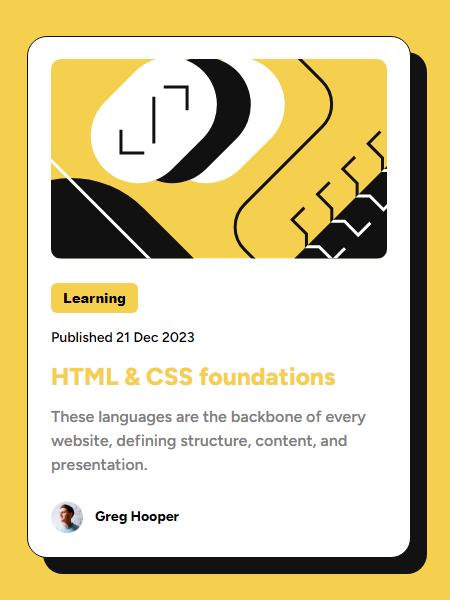

# Frontend Mentor - Blog preview card solution

This is a solution to the [Blog preview card challenge on Frontend Mentor](https://www.frontendmentor.io/challenges/blog-preview-card-ckPaj01IcS). Frontend Mentor challenges help you improve your coding skills by building realistic projects.

## Table of contents

- [Overview](#overview)
  - [The challenge](#the-challenge)
  - [Screenshot](#screenshot)
  - [Links](#links)
- [My process](#my-process)
  - [Built with](#built-with)
- [Author](#author)

## Overview

### The challenge

Users should be able to:

- See hover and focus states for all interactive elements on the page

### Screenshot

### Links

- Solution URL: [linked to Frontend Mentor site](https://www.frontendmentor.io/solutions/responsive-blog-preview-card-with-html-css-qYPL7unMeL)
- Live Site URL: [linked to GitHub site](https://adib27moghimi.github.io/FEM-01-blog-preview-card/)

## My process

### Built with

- Semantic HTML5 markup
- CSS custom properties
- Flexbox
- Mobile-first workflow

## Author

- Frontend Mentor - [@Adib27Moghimi](https://www.frontendmentor.io/profile/Adib27Moghimi)
- Telegram - [Adib Moghimi](https://t.me/Adib70m)
